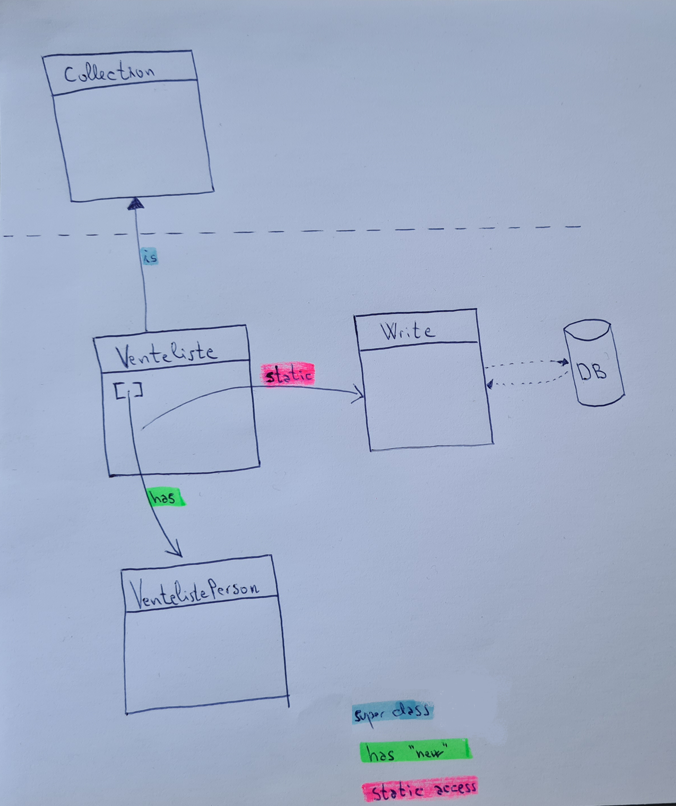
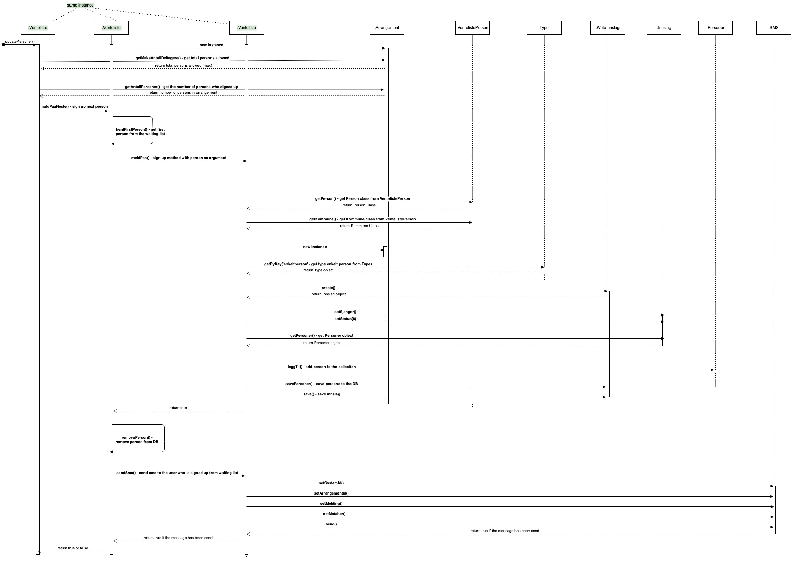

# Venteliste
Venteliste representerer en liste hvor personer som skal meldes på fra delta.ukm.no venter. Venteliste brukes når det ikke er ledige plasser på et arrangement.

OBS: I dag brukes venteliste kun på WORKSHOP arrangementer.

### Class Diagram

### Sequence Diagram for the most important method updatePersoner() 

