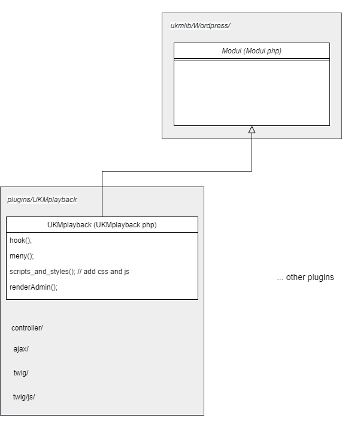

# UKM Wordpress-plugins

[Wordpress/Modul.php](Wordpress/Modul.php) er en abstrakt klasse som alle våre wordpress-plugins skal extende. Klassen initialiseres ved å sende plugin-bane og tilbyr funksjonalitet for å hente et arrangement, flashbag, ajax-requests og rendrer admin-GUI ved hjelp av twig.

## Modul-fil
Hvis du bruker [UKM.code-workspace](https://github.com/UKMNorge/blob/master/servere/UKM.code-workspace) finner du alle våre plugins i mappen [VM: main/plugins](shared/main/plugins)


Alle våre plugins har en PHP-fil med samme navn som plugin'ens navn (heretter kalt hovedfil). For eksempel plugin med navnet `UKMkalender` har en fil `UKMkalender.php` hvor plugin defineres. 

Alle plugins starter med en kommentar som forteller Wordpress at denne filen er en plugin fil.

```php
<?php  
/* 
Plugin Name: UKM Plugin
Plugin URI: http://org.ukm.no
Description: En dummyplugin som vi benytter
Author: UKM Norge / Utviklernavn
Version: 1.0 
Author URI: http://github.com/UKMNorge
*/
```

Alle UKM-plugins følger denne definerte mappestrukturen:
```
UKMplugin/
    controller/
    ajax/
    twig/
        js/
    UKMplugin.php
```

I `UKMplugin.php` må du definere klassen din, typisk sånn:
```php
<?php
use UKMNorge\Wordpress\Modul;

class UKMplugin extends Modul {}
```


## Viktige funksjoner i [Modul.php](Wordpress/Modul.php)

### Klargjøring av plugin

#### `UKMPlugin::init(__FILE__)`
Initierer modulen, og setter filbane internt i klassen. Vi kjører alltid denne funksjonen i bunn av `UKMplugin.php`.
Plugin-filen kalles på nytt hver gang siden lastes på nytt.

#### `UKMPlugin::hook()`
Her hooker du plugin inn i wordpress. Som oftest er det snakk om en meny-hook, som er definert f.eks. som dette:

**OBS:** Merk at du alltid må definere `$action` og `$path_plugin` i klassen din! Disse kommer vi tilbake til under `renderAdmin()` nedenfor.

```php
class UKMplugin extends Modul {
    public static $action = 'home';
    public static $path_plugin = null;
    
    public static function hook() {
        add_action(
            'admin_menu', 
            [static::class, 'meny']
        );
    }
}
```

[add_action('admin_menu', `$callback`)](https://developer.wordpress.org/reference/functions/add_action/) gjør at wordpress kjører `$callback`-funksjonen din når det er på tide å rendre menyen, som i dette tilfellet da er `UKMplugin::meny()`.

Neste steg er å definere funksjonen som skal kalles. Legg merke til at funksjonsnavnet `meny` ble definert i `hook`-funksjonen, som andre parameter i `add_action()`.

```php
class UKMplugin extends Modul {
    [...]
    public static function meny() {
        add_menu_page(
            $page_title,
            $menu_title,
            $capability,
            $menu_slug,
            [static::class, 'renderAdmin'],
            $icon_url = '',
            $position = null
         );
    }
}
```
[add_menu_page()](https://developer.wordpress.org/reference/functions/add_menu_page/) legger til siden din i menyen. 

Merk at selv om vi kjører et standard kall til [add_menu_page()](https://developer.wordpress.org/reference/functions/add_menu_page/) er parameter 5, `callable $function` som wordpress kaller det i dokumentasjonen, et array med referanse til denne klassen (`static::class` og funksjonen `renderAdmin()`). Du lærer mer om dette nedenfor.

#### Bootstrap av UKMplugin.php ser dermed sånn ut
```php
<?php

use UKMNorge\Wordpress\Modul;

class UKMplugin extends Modul {
    public static $action = 'home';
    public static $path_plugin = null;

    public static function hook() {
        add_action(
            'admin_menu', 
            [static::class, 'meny']
        );
    }

    public static function meny() {
        add_menu_page(
            $page_title,
            $menu_title,
            $capability,
            $menu_slug,
            [static::class, 'renderAdmin'],
            $icon_url = '',
            $position = null
         );
    }
}
UKMplugin::init(__FILE__);
UKMplugin::hook();
```

### Rendre ut GUI'et ditt: `renderAdmin()`
Før eller senere vil du mest sannsynlig vise brukeren noe av plugin'en din også, og det er kanskje her det skjer mest magi.

Når brukeren trykker på menyen din, vil Wordpress kjøre funksjonen du definerte i parameter 5 av [add_menu_page()](https://developer.wordpress.org/reference/functions/add_menu_page/), som mest sannsynlig er funksjonen `UKMplugin::renderAdmin()`, som ligger i [Modul.php](Wordpress/Modul.php).


`renderAdmin()` vil:
1. Finne hvilken action som skal vises. 

>Hvis du ikke har kjørt `UKMplugin::setAction(String $action)`, vil action være det du definerte i pluginfilen (`public static $action = 'home';`, altså `home` i eksempelet).
2. Sende alle viewData til twig
3. Sjekke om `controller/$action.controller.php` finnes, og i tilfelle kjøre controller-filen.
4. Rendre `twig/$action.html.twig`, altså `twig/home.html.twig` i eksempelet.


#### `UKMplugin::setAction(String $action)`
Hvis du ønsker å kjøre en annen action enn du definerte i klassen, benytter du `setAction()`. Husk at du da MÅ opprette `$action.html.twig` i `twig`-mappen.

### Controller-filen
De færreste plugins klarer seg uten en controller. UKM-plugins tar utgangspunkt i at én action har et view, og (kanskje) en controller. 

#### `UKMplugin::addViewData($key, $value)`
For å legge til viewdata som skal sendes til twig-filen, benytter du `addViewData()`. Her kan du sende inn et [$key => $value] array som $key, eller definere enkelt-variabler som $key og $value. Sender du inn et array, merges det automatisk med eksisterende verdier.

### Når du skal inkludere assets (javascript og css)
Vi bruker wordpress sin funksjon for å laste inn css og js-assets. Typisk må du da modifisere `meny()`-funksjonen din på denne måten, som gjør at wordpress automatisk kjører `scripts_and_styles()`-funksjonen din når meny-elementet ditt vises:

```php
    public static function meny() {
        add_action(
            'admin_print_styles-' . 
                add_menu_page([...]),
            [static::class, 'scripts_and_styles'
        );
    }
```

kanskje er det mer lesbart for deg på denne måten:
```php
    public static function meny() {
        $page_id = add_menu_page([...]);
        add_action(
            'admin_print_styles-' . $page_id
            [static::class, 'scripts_and_styles'
        );
    }
```

Deretter kan du bruke wordpress sine [wp_enqueue_script()](https://developer.wordpress.org/reference/functions/wp_enqueue_scripts/) eller [wp_enqueue_style()](https://developer.wordpress.org/reference/functions/wp_enqueue_scripts/) på vanlig måte.

Til dette er det nyttig å bruke `UKMplugin::getPluginUrl()`for å hente riktig filbane, f.eks. som dette:
```php
class UKMplugin extends Modul {
    [...]
    public static function scripts_and_styles() {
        wp_enqueue_script(
            'UKMMplugin_script',
            static::getPluginUrl()  . 'js/script.js'
        );
    }
}
```

### Arrangementet

#### `getArrangement()`
Ut fra hvilken URL du besøker vet wordpress hvilken blogg du er på, og hvilket arrangement denne bloggen tilhører. `getArrangement()` gir deg derfor riktig [Arrangement](Arrangement/Arrangement.php)-objekt.

Internt bruker funksjonen `Modul::getArrangementId()`

#### `getArrangementId()`
Denne trenger du sjeldent, da du som oftest jobber direkte med `getArrangement()`.

Internt bruker funksjonen wordpress sin [get_option('pl_id')](https://developer.wordpress.org/reference/functions/get_option/) for å hente arrangement-ID.

### Tilbakemelding til brukeren (Flashbag)

#### `getFlash()` eller `getFlashbag()`
Returnerer en instans av [UKMNorge\Flashbag](Flashbag.php) som kan sende flash-messages via $_SESSION-variabelen.


For å sende en success-melding til neste side, kan du kjøre en av disse
```php
Modul::getFlash()->success('Dette gikk bra');
Modul::getFlash()->warning('Dette gikk nesten bra');
Modul::getFlash()->error('Auda, dette gikk ikke bra');
```

Bare husk at Twig-template'n din må embedde flashbag-filen
```twig

```

Flashbag'en håndterer selv alt av sletting osv, så meldingen din vil kun vises én gang, og om du sender inn flere meldinger, vil de vises under hverandre.


### Ajax

#### `setupAjax()`
Hvis plugin'en din skal bruke ajax, må du kjøre `setupAjax()`, som forteller wordpress om at du plugin støtter ajax.

For å sende et ajax-kall må du.....

#### `UKMplugin::addResponseData()`
I ajax-filen bruker du `addResponseData()` i stedet for `addViewData()`. Funksjonene oppfører seg likt.

Relasjon mellom plugin og modul
====



